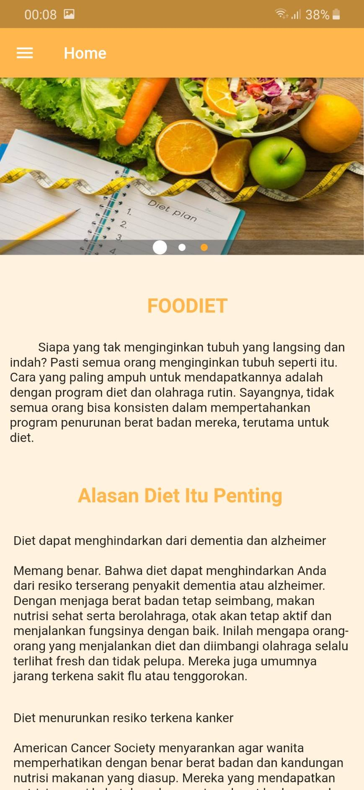
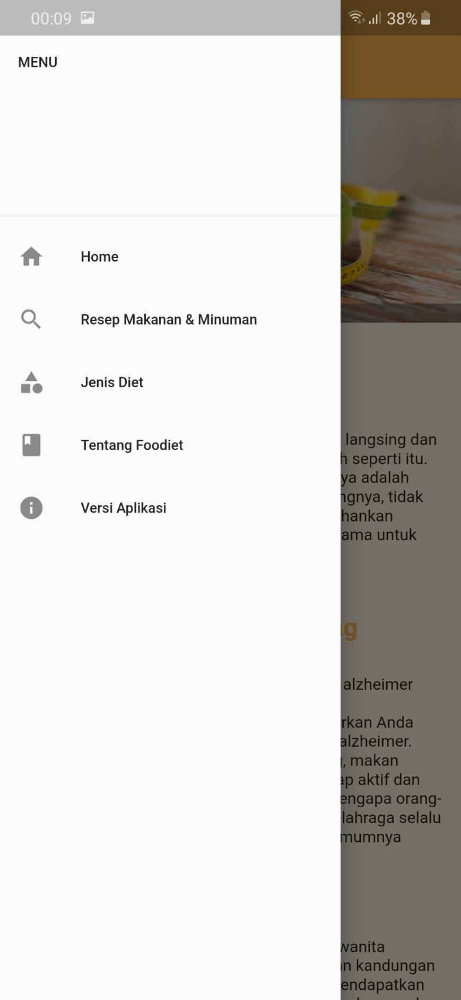
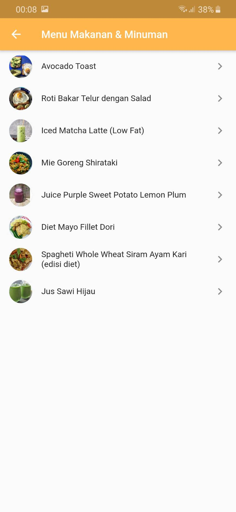
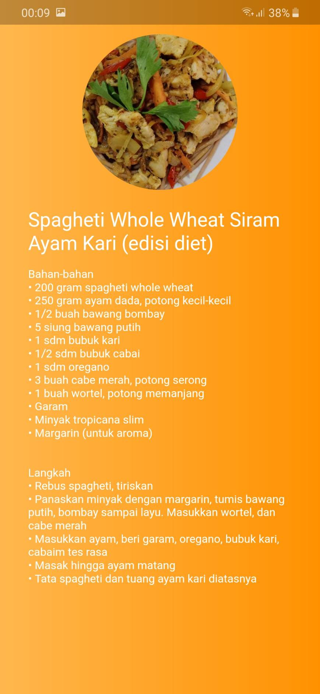
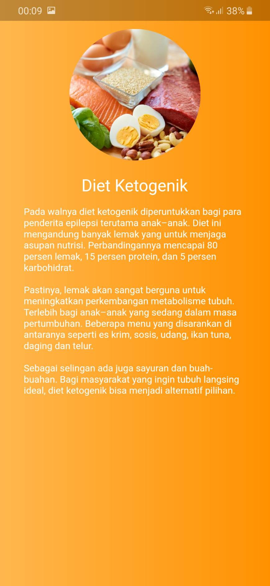
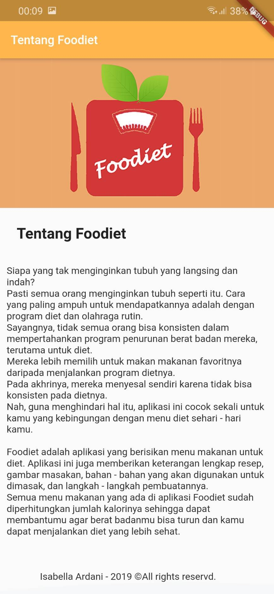
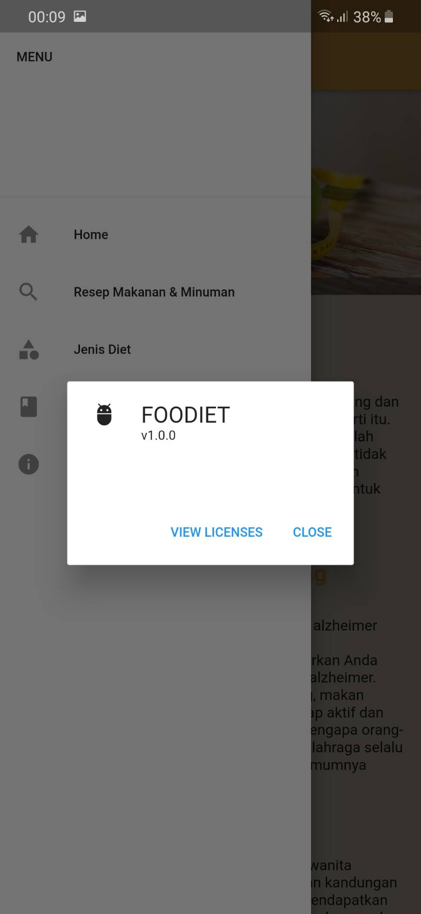

<h1>APLIKASI FOODIET</h1>
Foodiet adalah aplikasi yang berisikan resep menu makanan untuk diet yang sehat. Aplikasi ini juga memberikan keterangan lengkap resep, gambar masakan, bahan - bahan yang akan digunakan untuk dimasak, dan langkah - langkah pembuatannya.
Di aplikasi ini juga kita dapat mengetahui jenis - jenis diet yang baik dan benar. Semua menu makanan yang ada di aplikasi Foodiet sudah diperhitungkan jumlah kalorinya sehingga dapat membantumu agar berat badanmu bisa turun dan kamu dapat menjalankan diet yang lebih sehat.

<h2>Berikut tampilan dari aplikasi FOODIET</h2>
<h3>1. Home</h3>

<h3>2. Menu</h3>

<h3>3. Resep Makanan & Minuman</h3>

<h3>4. Detail Resep Makanan & Minuman</h3>

<h3>5. Jenis Diet</h3>

<h3>6. Detail Jenis Diet</h3>

<h3>7. Tentang Diet</h3>

<h3>8. Versi Aplikasi</h3>

